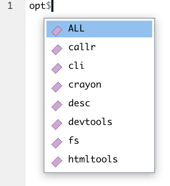
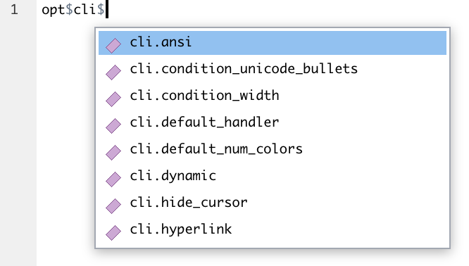
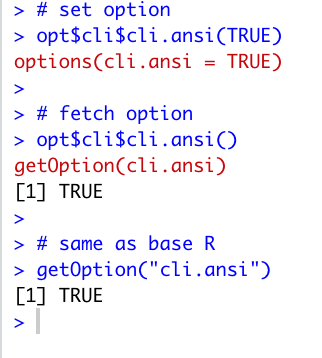
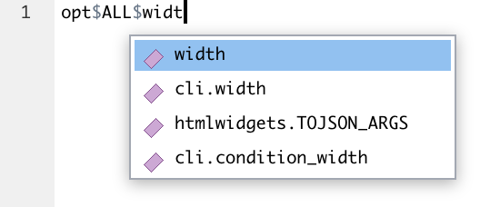

<!-- README.md is generated from README.Rmd. Please edit that file -->

# opt 

{opt} helps you set options.

You can set options using autocomplete, so you easily find the options
you need and don’t misspell them. It also includes a mechanism to check
option values.

EDIT: This seems to work with `devtools::load_all()` but not with
`library(opts)`, will fix ASAP

## Installation

Install with:

``` r
remotes::install_github("moodymudskipper/opt")
```

## How to use

`opt` is the only object in the package, it behaves like a list, and
allows you to set your options as illustrated below.





 Set `options(opt.verbose = FALSE)` (or
`opt$opt$opt.verbose(FALSE)` !) to disable the `options()` /
`getOptions()` messages. {opt} is a bit too slow to be used in packaged
code and might not be worth an extra dependency so this message helps
you copy and paste the relevant base R call.

The `ALL` option integrates all package options + all other options
found in `options()`, it’s convenient to find any option with
autocomplete, for example here looking for `width`:



`opt` is always up to date, because of some magic explained at the end
of the README.

If it’s useful to you you might enumerate the available options with
`names()` :

``` r
library(opt)
names(opts$callr)
#> [1] "callr.compress_transport" "callr.error"              "callr.traceback" 
```

## How to validate option values

If you place in the “/inst” folder of your package an “opt.dcf” file
similar to the example below, users of {opt} will have their inputs
validated, no need for you to add {opt} as a dependency.

in {opt} itself the “/inst/opt.dcf” file is the following

    verbose: if (!is.logical(value) || length(value) != 1 || is.na(value)) stop("The `opt.verbose` option should be boolean.", call. = FALSE)
    character_test: stopifnot(is.character(value))
    foobar_test: match.arg(value, c("foo", "bar"))

Then when setting options wrongly:

``` r
opt$opt$opt.verbose(1)
#> Error: The `opt.verbose` option should be boolean.

opt$opt$opt.character_test(1)
#> Error in opt$opt$opt.character_test(1) : is.character(value) is not TRUE

opt$opt$opt.foobar_test("baz")
#> Error in match.arg(value, c("foo", "bar")) : 
#>   'arg' should be one of “foo”, “bar”
```

## How it works

The code of loaded packages is inspected for calls to `getOption()` or
{rlang}’s `local_options()`, `with_options()`, `push_options()`,
`peek_options()`, `peek_option()`, where option names are found.

It’s done when {opt}’s namespace is loaded, but also updated anytime you
type `opt$`.

## Dependencies

{opt} has zero dependencies so it’s safe to have `library(opt)` in your
`.RProfile`.
